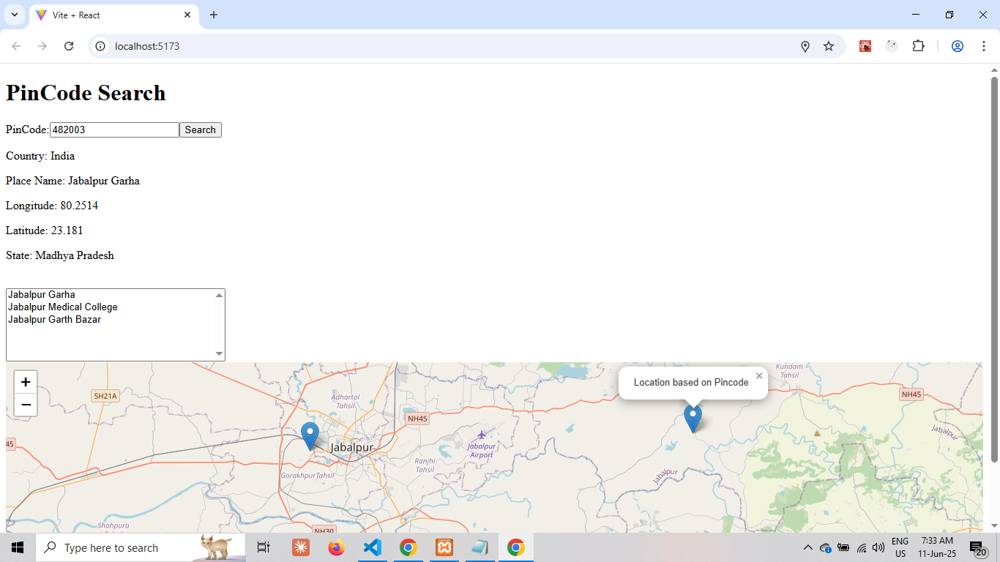

# PinCode Geolocation Search

A React application that uses OpenStreetMap to provide geolocation services and allows users to search for locations based on their Postal Index Number (PIN Code).

The app can display your current location along with the relative position of the specified PIN code.

